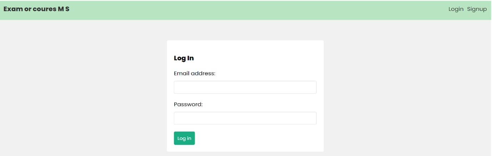

# Course Approval and Exam Approval Software
## Table of Contents
- [Introduction](#introduction)
- [Functionality](#functionality)
- [Technologies](#technologies)
- [Screenshots](#screenshots)
- [Setup and Usage](#setup-and-usage)

## Introduction
This project was developed as an undergraduate software engineering project at the Department of Computer Engineering, Faculty of Engineering, University of Jaffna. The goal of the project is to create an efficient and user-friendly system for academic staff to approve courses and exams for students.

## Functionality
- Secure login for users
- Option to log in using office 365 account
- System administrator can open/close registration for course and exam registration
- Student adviser can approve courses
- Course coordinator can approve exams
- Students can request course and exam registration
- Students can view previous course registrations
- Head of department can view all requests from students
- API ports created to fetch course information

## Technologies
- MongoDB (document database)
- Express (.js) (Node.js web framework)
- React (.js) (client-side JavaScript framework)
- Node (.js) (JavaScript web server)
- VS CODE (code editor)
- Slack (communication tool)
- kanbanboard (project management tool)

<!-- 

## Screenshots
i. Registration
(photo)

Registration validation 
(photo)

ii. Log in 
(photo)
- Login validation
(photo)

iii. Exam registration
(photo)

iv. Exam registration add list
(photo)

v. Exam registered
(photo)

vi. Exam approval
(photo)

vii. Exam approval after
(photo)
 -->

## Screenshots

i. Registration

- Registration validation

ii. Log in

- Login validation

iii. Exam registration

iv. Exam registration add list

v. Exam registered

vi. Exam approval

vii. Exam approval after

